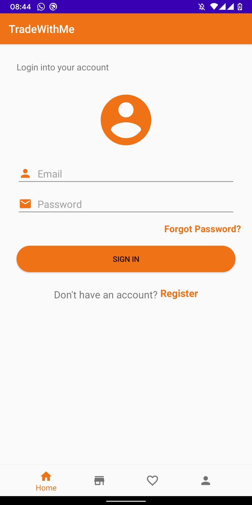
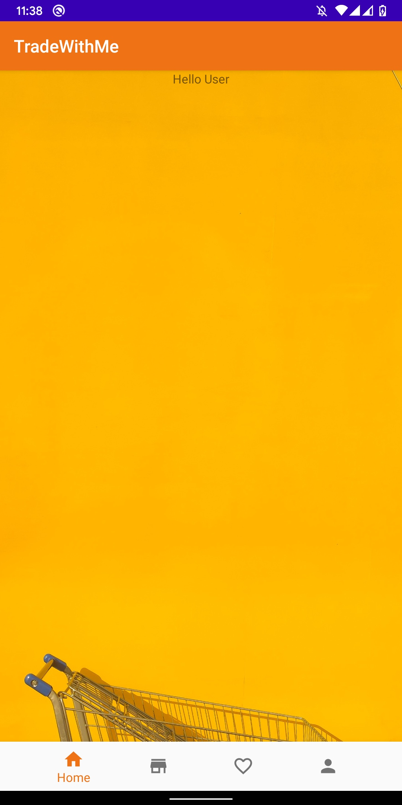
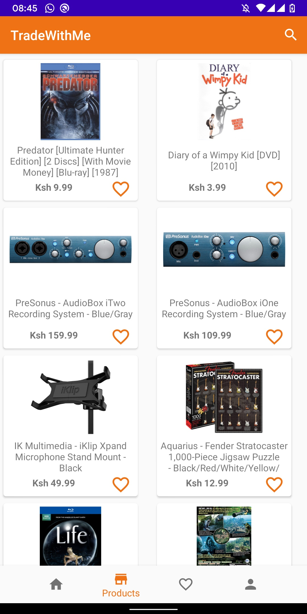
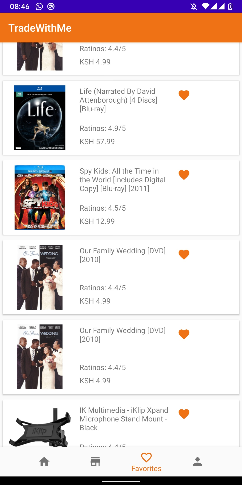
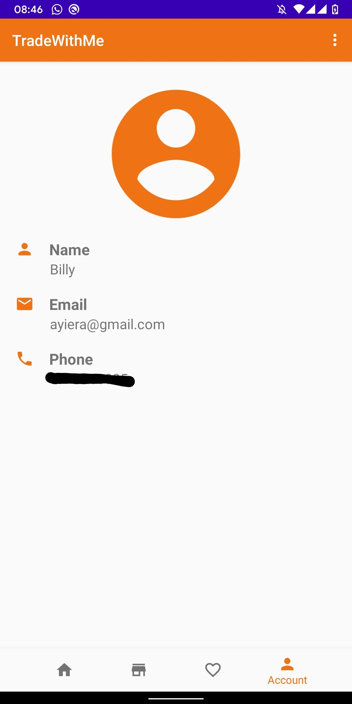
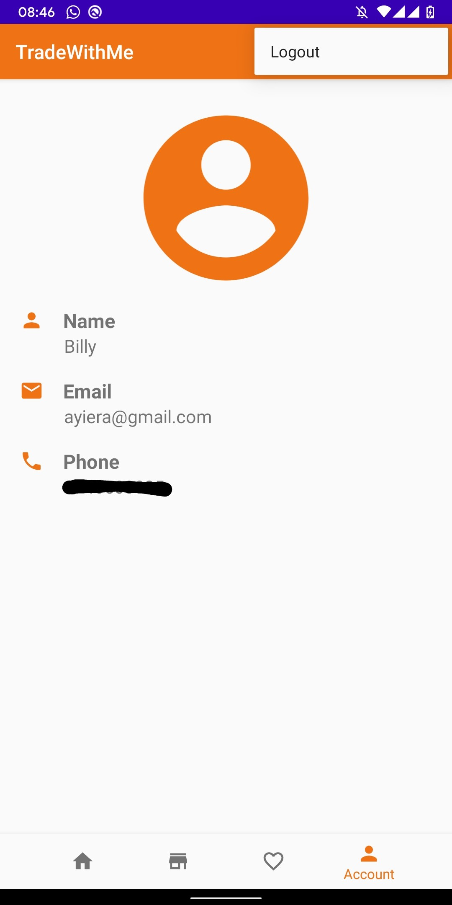

# TradeWithMe

* TradeWithMe is an app that is built with intentions of helping people easily trade online.
* With features like favorites, you can add a list of what you're interested in to purchase later after a sign up.

# Prerequisites

> Android Studio Download [here](https://developer.android.com/studio/install)

> Java Download [here](https://www.oracle.com/java/technologies/javase-jdk11-downloads.html)

# Installing

* Clone the app using the link below in the terminal after you are done downloading and installing android studio and java listed above.

* Open android studio and open the cloned file.

#### Setting the phone

> 1. Connect your phone to data cable

> 2. Navigate to your phone settings

> 3. Select about phone

> 4. Click on the build number five times to activate developer options(Developer option will be activated)

> 5. Select on developer option and select usb debugging

> 6. Install TradeWithMe app from your android studio.

# Get started

  
 
  

# Technologies used

* Java

* Android Studio

* Gradle

# Author
> Billy Ayiera

# CopyRight & License

MIT License
Copyright (c) [2020]

Permission is hereby granted, free of charge, to any person obtaining a copy
of this software and associated documentation files (the "Software"), to deal
in the Software without restriction, including without limitation the rights
to use, copy, modify, merge, publish, distribute, sublicense, and/or sell
copies of the Software, and to permit persons to whom the Software is
furnished to do so, subject to the following conditions:

The above copyright notice and this permission notice shall be included in all
copies or substantial portions of the Software.

THE SOFTWARE IS PROVIDED "AS IS", WITHOUT WARRANTY OF ANY KIND, EXPRESS OR
IMPLIED, INCLUDING BUT NOT LIMITED TO THE WARRANTIES OF MERCHANTABILITY,
FITNESS FOR A PARTICULAR PURPOSE AND NON-INFRINGEMENT. IN NO EVENT SHALL THE
AUTHORS OR COPYRIGHT HOLDERS BE LIABLE FOR ANY CLAIM, DAMAGES OR OTHER
LIABILITY, WHETHER IN AN ACTION OF CONTRACT, TORT OR OTHERWISE, ARISING FROM,
OUT OF OR IN CONNECTION WITH THE SOFTWARE OR THE USE OR OTHER DEALINGS IN THE
SOFTWARE.